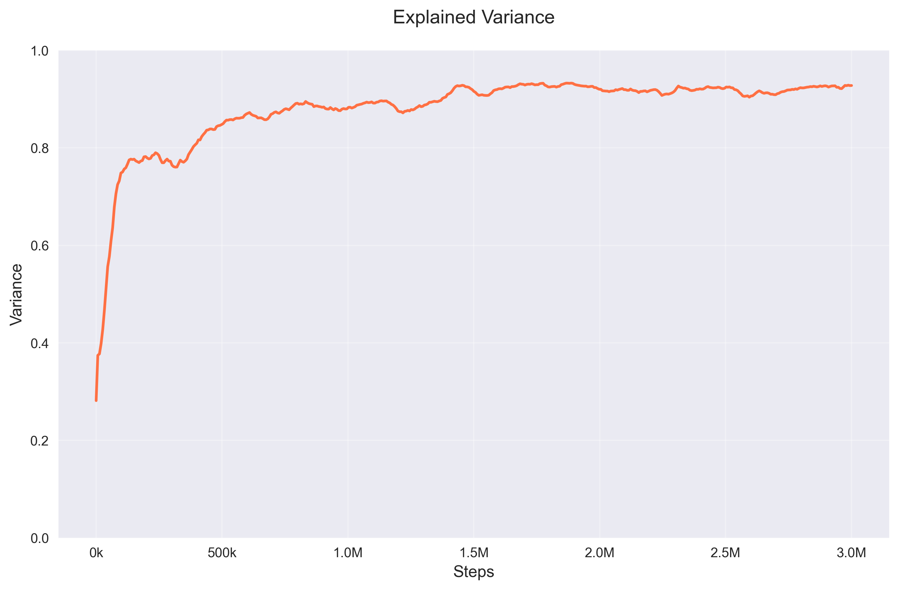
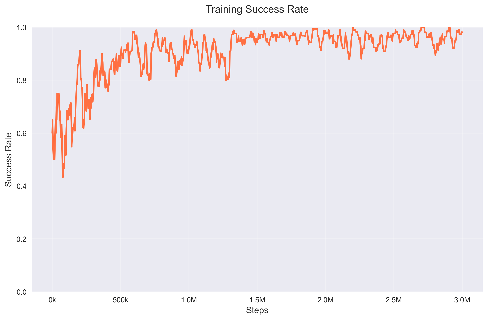
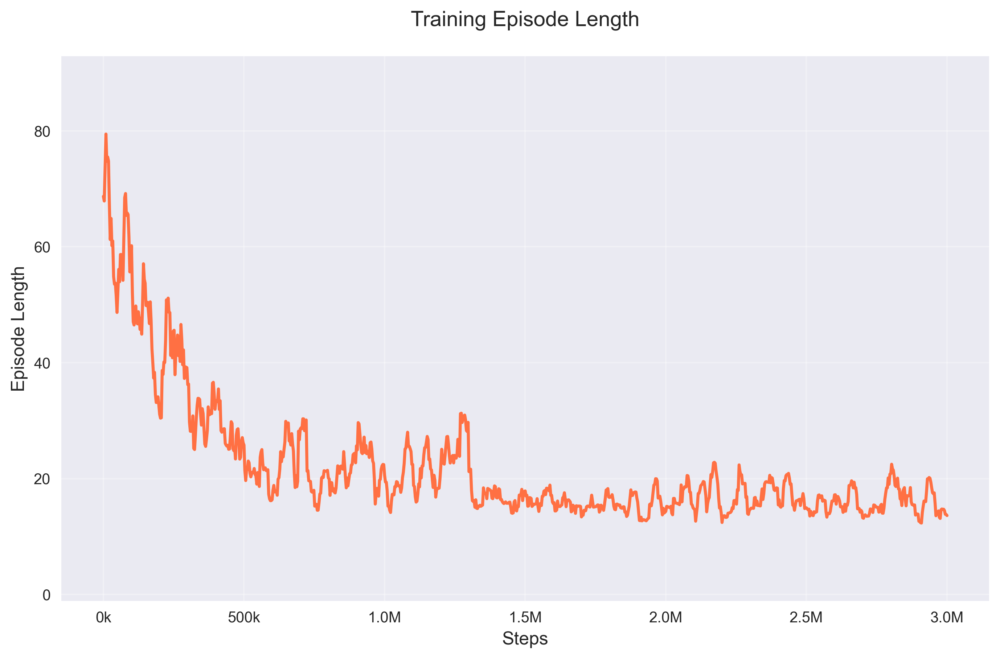
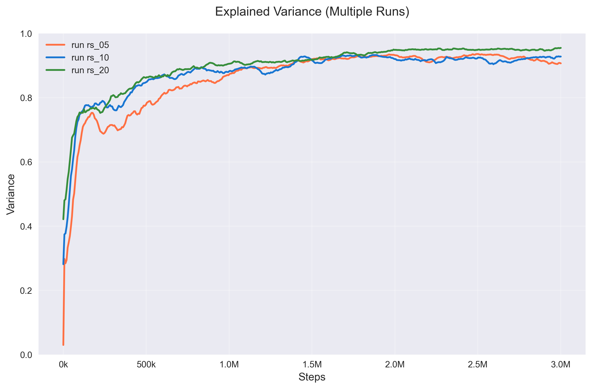
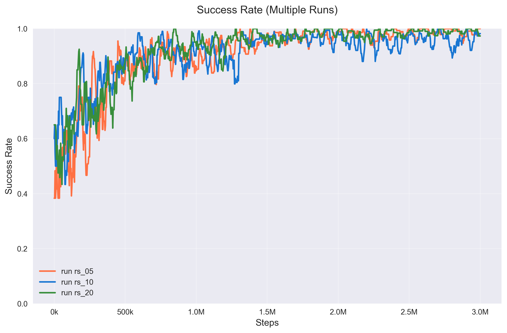

# Robotic Manipulation with Reinforcement Learning

[](https://www.python.org/downloads/)
[](https://pytorch.org/)
[](https://opensource.org/licenses/MIT)

This repository implements reinforcement learning algorithms for robotic manipulation tasks using the ManiSkill environment. The project focuses on training agents to perform complex manipulation tasks like pushing cubes and hitting targets. The PPO implementation is based on the [ManiSkill PPO baseline](https://github.com/haosulab/ManiSkill/tree/main/examples/baselines/ppo) by Haosu Lab.

## 🎯 Project Overview

This project demonstrates the application of Proximal Policy Optimization (PPO) to robotic manipulation tasks. The main task involves training a robotic arm to push a cube and hit another cube, showcasing advanced reinforcement learning techniques in a realistic physics simulation environment.

### Key Features

- **Custom Environment**: Implementation of `PushCubeHitCube-v1` environment with dense reward shaping
- **PPO Algorithm**: Complete implementation of Proximal Policy Optimization with GAE
- **Multi-environment Training**: Parallel environment training for efficient learning
- **Comprehensive Logging**: TensorBoard integration for training visualization
- **Evaluation Framework**: Robust evaluation and model checkpointing

## 📊 Results

Our trained agents achieve excellent performance on the robotic manipulation tasks:

### Training Performance


*Explained variance progression showing rapid learning and stable convergence*


*Training success rate reaching near-perfect performance*


*Decreasing episode length indicating improved efficiency*

### Multi-Run Comparison


*Consistent performance across different random seeds*


*Robust learning across multiple training runs*

## 🚀 Quick Start

### Prerequisites

- Python 3.8+
- CUDA-compatible GPU (recommended)
- ManiSkill environment

### Installation

1. **Clone the repository:**
   ```bash
   git clone https://github.com/WeiHanTu/robotic-manipulation-rl.git
   cd robotic-manipulation-rl
   ```

2. **Install ManiSkill:**
   ```bash
   pip install mani-skill
   ```

3. **Install additional dependencies:**
   ```bash
   pip install torch torchvision torchaudio
   pip install gymnasium tensorboard tyro
   ```

### Training

#### Basic Training
```bash
python train.py --env_id PushCubeHitCube-v1 --total_timesteps 1000000
```

#### Advanced Training with Custom Parameters
```bash
python train.py \
    --env_id PushCubeHitCube-v1 \
    --total_timesteps 3000000 \
    --learning_rate 3e-4 \
    --num_envs 512 \
    --num_steps 50 \
    --gamma 0.8 \
    --gae_lambda 0.9 \
    --clip_coef 0.2 \
    --update_epochs 4 \
    --num_minibatches 32 \
    --target_kl 0.1 \
    --ent_coef 0.0 \
    --vf_coef 0.5 \
    --max_grad_norm 0.5 \
    --save_model \
    --capture_video
```

#### Baseline Training (PickCube Environment)
```bash
python baseline.py --env_id PickCube-v1 --total_timesteps 1000000
```

### Evaluation

```bash
python train.py --evaluate --checkpoint runs/PushCubeHitCube-v1__train__1__1234567890/model.pt
```

### Demo

Run a demonstration with random actions:
```bash
python demo_random_actions.py
```

## 📁 Project Structure

```
robotic-manipulation-rl/
├── train.py                 # Main training script with PPO implementation
├── baseline.py              # Baseline implementation for comparison
├── push_cube_hit_cube.py   # Custom environment implementation
├── demo_random_actions.py  # Demo script for visualization
├── figures/                # Training plots and visualizations
│   └── png/               # Generated training plots
├── videos/                 # Training and evaluation videos
└── runs/                   # Training logs and model checkpoints
```

## 🔧 Environment Details

### PushCubeHitCube-v1

Our custom environment extends the base `PushCube` environment with additional complexity:

- **Objective**: Push cube A to hit cube B
- **Observation**: State information including both cubes' positions and orientations
- **Action Space**: 7-dimensional joint delta position control
- **Reward**: Dense reward based on distance between cubes with success bonus
- **Success Condition**: Distance between cubes < 0.015 units

### Key Implementation Features

1. **Dense Reward Shaping**: Continuous reward based on cube proximity
2. **Success Bonus**: +1 reward when task is first completed
3. **Early Termination**: Episode ends immediately upon success
4. **Randomized Initialization**: Cube B position randomized each episode

## 🧠 Algorithm Details

### PPO Implementation

The training uses Proximal Policy Optimization with the following key components:

- **Actor-Critic Architecture**: Separate networks for policy and value function
- **GAE (Generalized Advantage Estimation)**: λ=0.9 for advantage estimation
- **Clipped Surrogate Loss**: ε=0.2 clipping parameter
- **Value Function Clipping**: Optional value function clipping
- **Entropy Regularization**: Configurable entropy coefficient
- **Gradient Clipping**: Max gradient norm of 0.5

**Reference Implementation**: This PPO implementation is based on the [ManiSkill PPO baseline](https://github.com/haosulab/ManiSkill/tree/main/examples/baselines/ppo) by Haosu Lab, adapted for our custom `PushCubeHitCube-v1` environment.

### Network Architecture

- **Actor Network**: 256-unit hidden layers with tanh activation
- **Critic Network**: 256-unit hidden layers with tanh activation
- **Initialization**: Orthogonal initialization for stable training

## 📈 Training Configuration

### Default Hyperparameters

| Parameter | Value | Description |
|-----------|-------|-------------|
| Learning Rate | 3e-4 | Adam optimizer learning rate |
| Total Timesteps | 3M | Total training steps |
| Num Environments | 512 | Parallel environments |
| Num Steps | 50 | Steps per rollout |
| Gamma | 0.8 | Discount factor |
| GAE Lambda | 0.9 | GAE parameter |
| Clip Coefficient | 0.2 | PPO clipping parameter |
| Update Epochs | 4 | Policy update iterations |
| Minibatch Size | 32 | Number of minibatches |

### Training Monitoring

The training process logs various metrics:

- **Explained Variance**: Value function prediction quality
- **Policy Loss**: Actor network loss
- **Value Loss**: Critic network loss
- **Episode Length**: Steps per episode
- **Return**: Episode returns
- **Success Rate**: Task completion rate

## 🎮 Usage Examples

### Custom Environment Training

```python
import gymnasium as gym
import push_cube_hit_cube

# Create environment
env = gym.make("PushCubeHitCube-v1", 
               obs_mode="state",
               control_mode="pd_joint_delta_pos")

# Reset and step
obs = env.reset()
action = env.action_space.sample()
obs, reward, done, truncated, info = env.step(action)
```

### Model Evaluation

```python
import torch
from train import Agent

# Load trained model
model = Agent(envs)
checkpoint = torch.load("runs/model.pt")
model.load_state_dict(checkpoint["model_state_dict"])

# Evaluate
with torch.no_grad():
    action = model.get_action(obs, deterministic=True)
```

## 📊 Performance Analysis

### Training Curves

The training process shows several key characteristics:

1. **Rapid Initial Learning**: Explained variance increases quickly in the first 200k steps
2. **Stable Convergence**: Performance stabilizes around 90% explained variance
3. **Consistent Success**: Success rate reaches near-perfect levels
4. **Efficient Episodes**: Episode length decreases as agent learns optimal strategies

### Multi-Run Stability

Experiments across different random seeds (rs_05, rs_10, rs_20) demonstrate:

- **Consistent Performance**: All runs achieve similar final performance
- **Robust Learning**: Similar learning curves across different initializations
- **Convergence**: All runs converge to high success rates

## 🤝 Contributing

We welcome contributions! Please feel free to submit issues, feature requests, or pull requests.

### Development Setup

1. Fork the repository
2. Create a feature branch: `git checkout -b feature-name`
3. Make your changes and add tests
4. Commit your changes: `git commit -am 'Add feature'`
5. Push to the branch: `git push origin feature-name`
6. Submit a pull request

## 📄 License

This project is licensed under the MIT License - see the [LICENSE](LICENSE) file for details.

## 🙏 Acknowledgments

- **ManiSkill Team**: For providing the excellent robotic manipulation environment
- **Haosu Lab**: For the original PPO baseline implementation in [ManiSkill examples](https://github.com/haosulab/ManiSkill/tree/main/examples/baselines/ppo)
- **OpenAI**: For the PPO algorithm implementation inspiration
- **PyTorch Team**: For the deep learning framework

## 📞 Contact

- **Author**: Wei Han Tu
- **GitHub**: [@WeiHanTu](https://github.com/WeiHanTu)
- **Project**: [robotic-manipulation-rl](https://github.com/WeiHanTu/robotic-manipulation-rl)

---

**Note**: This project was developed as part of CSE276F: Machine Learning for Robotics coursework. The implementation demonstrates advanced reinforcement learning techniques for robotic manipulation tasks. 